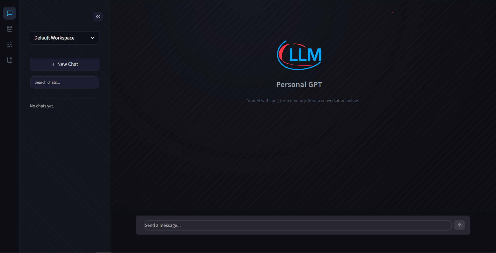

# 🧠 Persistent Memory Chatbot (Streamlit + Mem0)

A personalized, context-aware chatbot interface that remembers facts, preferences, interests, and age details about users across sessions. Built with **Streamlit** and powered by **Mem0** for long-term memory persistence and **Groq / Gemini / OpenAI** for conversational backend.

---

## ✨ Interface Overview



---

## ✨ Features

- **🔄 Multi-Session Persistence**: Chatbot remembers what you said (e.g., "I am 25 years old") even after database reload or application restarts.
- **⚡ Fact Overrides & Updates**: Intelligently updates memory records when new facts contradict old ones (e.g., "I am 26 now" replaces 25).
- **👥 Active User Switching**: Toggle active User IDs in the sidebar. Instant switching of long-term memory profile spaces to support multi-user operations.
- **🛠️ Interface Memory Management**: Review all stored memory facts in the sidebar. Delete specific outdated memories individually or wipe user memories.
- **🔍 Injection Telemetry**: Interactive debug view displaying exactly what context memories were retrieved and injected into the LLM prompt.
- **🚀 Multi-Backend Support**: Seamless switching between Gemini, OpenAI, and Groq SDK architectures.

---

## 📂 Project Structure

```
mem0-memory-agent/
├── app_core/                 # Core Backend Logic
│   ├── app.py                # Streamlit Application Flow & Entry Point
│   ├── memory_handler.py     # Mem0 Vector Memory Storage & Retrieval
│   └── llm_connector.py      # Multi-provider LLM API streaming (Groq/Gemini/OpenAI)
├── assets/                   # SVG Graphic Assets
│   ├── human.svg             # User avatar graphic
│   ├── robot.svg             # Assistant avatar graphic
│   └── logo.svg              # Orbital LLM welcome logo
├── ui/                       # Modular Frontend UI Components
│   ├── screenshot/           # UI screenshot directory
│   │   └── interface.PNG     # Web application layout screenshot
│   ├── styles.py             # Global CSS themes & texture rules
│   ├── navigation.py         # Fixed icon sidebar JS component
│   ├── sidebar.py            # Workspace, history, memories & config tabs
│   ├── chat.py               # Chat viewports & welcome screen
│   └── stream_handler.py     # Live streaming response UI handler
├── tests/
│   ├── verify_memory.py      # Automated memory integration tests
│   ├── test_filters.py       # Platform client filter tests
│   └── test_api.py           # API signature verification
├── main.py                   # Application bootstrapper
├── .env                      # System credentials (Git ignored)
├── .gitignore                # Git ignore patterns
└── pyproject.toml            # Package dependencies
```

---

## 🚀 Setup & Installation

### 1. Configure Credentials
Create a `.env` file in the root directory (already added to `.gitignore` to prevent leakage):

```env
# Mem0 Platform Token (starts with m0-)
mem0_api = "your_mem0_platform_api_key"

# LLM Providers (Supply at least one)
GROQ_API_KEY = "your_groq_api_key"
GEMINI_API_KEY = "your_gemini_api_key"
OPENAI_API_KEY = "your_openai_api_key"
```

*Note: If no Mem0 API key is supplied, the system automatically falls back to local SQLite/Qdrant memory client storage.*

### 2. Install Project Dependencies
Run from the root directory to install packages:
```bash
pip install -e .
```

---

## ⚡ Running the App

Start the Streamlit application:
```bash
streamlit run app_core/app.py
```
*(Or run `python main.py`)*

---

## 🧪 Running Tests

A comprehensive integration test simulates memory clearing, adding facts, querying semantic relevance, writing override updates, and calling LLM response endpoints.

Execute the automated test suite:
```bash
python tests/verify_memory.py
```

---

## 🔧 Core Components Detail

- [app_core/app.py](file:///c:/Users/Hp/Downloads/mem0-memory-agent/app_core/app.py): Entry point containing application execution flow, session state initialization, and query handling.
- [app_core/memory_handler.py](file:///c:/Users/Hp/Downloads/mem0-memory-agent/app_core/memory_handler.py): Handles standard `client.add()`, searches using `filters={"user_id": ...}`, and manages vector persistence.
- [app_core/llm_connector.py](file:///c:/Users/Hp/Downloads/mem0-memory-agent/app_core/llm_connector.py): Formulates prompt context payloads and streams responses from Groq, Gemini, or OpenAI.
- [ui/](file:///c:/Users/Hp/Downloads/mem0-memory-agent/ui): Encapsulates all layout styling, navigation icon bars, sidebar tabs, and chat message rendering.

